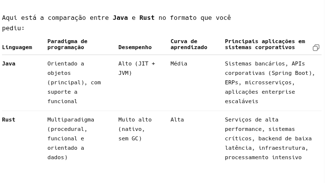

# Prompt 1: Compare Java e Rust
## Resposta: 

### Modelo de memória
#### Java
Usa Garbage Collector (GC) (limpeza automática de memória)
Mais fácil de programar
Pode ter pausas de performance (latência)
#### Rust
Não tem GC
Usa sistema de ownership (controle rígido de memória em tempo de compilação)
Zero memory leaks e alta segurança

## 👉 Resumo:
Java = facilidade
Rust = controle + performance

## ⚡ Performance
Java
Muito rápido (JIT otimiza em tempo de execução)
Ótimo para sistemas grandes
Rust
Performance próxima de C/C++
Extremamente eficiente (sem overhead de GC)

👉 Rust geralmente ganha em performance bruta

## 🧩 Facilidade de aprendizado
#### Java
Fácil de aprender
Sintaxe previsível
Muito material disponível
#### Rust
Curva de aprendizado alta
Conceitos difíceis (ownership, borrow checker)

👉 Rust é mais difícil no começo

## 🔒 Segurança
#### Java
Seguro contra erros comuns
Mas ainda pode ter problemas de memória indiretos
#### Rust
Segurança de memória garantida pelo compilador
Evita:
null pointer
data races
buffer overflow

👉 Rust é referência em segurança moderna

## 🏗️ Ecossistema e uso
#### Java
Muito usado em:
sistemas corporativos
bancos
APIs (Spring Boot)
Android
#### Rust
Muito usado em:
sistemas de baixo nível
backend de alta performance
blockchain
sistemas críticos
## 🧵 Concorrência (multithreading)
#### Java
Forte suporte (threads, executors)
Pode ter problemas se mal usado
#### Rust
Concorrência segura por padrão
O compilador evita data races

👉 Rust é mais seguro para concorrência

## 🛠️ Produtividade
#### Java
Alta produtividade
Desenvolvimento rápido
Mais "plug and play"
#### Rust
Desenvolvimento mais lento no começo
Código mais confiável no longo prazo
🧠 Resumo rápido (decisão)

Escolha Java se você quer:

Entrar rápido no mercado
Trabalhar com backend corporativo
Criar APIs e sistemas grandes
Produtividade e estabilidade

Escolha Rust se você quer:

Máxima performance
Trabalhar com sistemas críticos
Baixo nível (ou próximo disso)
Segurança de memória extrema
## 🚀 Comparação direta
Critério	Java 🟦	Rust 🦀
Facilidade	⭐⭐⭐⭐	⭐⭐
Performance	⭐⭐⭐⭐	⭐⭐⭐⭐⭐
Segurança	⭐⭐⭐⭐	⭐⭐⭐⭐⭐
Produtividade	⭐⭐⭐⭐⭐	⭐⭐⭐
Controle	⭐⭐	⭐⭐⭐⭐⭐
💡 Minha recomendação (prática)

Se você está começando ou quer mercado:
👉 vá de Java

Se você quer se destacar tecnicamente (nível avançado):
👉 aprenda Rust depois

# Prompt 2 (refinamento de prompt): Compare Java e Rust em uma tabela com quatro colunas: paradigma de programação, desempenho, curva de aprendizado e principais aplicações em desenvolvimento de sistemas corporativos.
## Resposta: 
