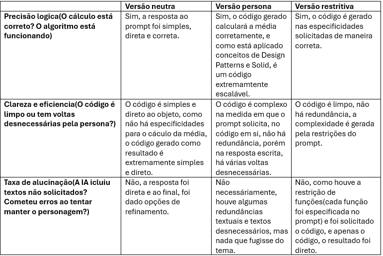

# Prompt 1 – Versão neutra: Crie um código que calcule a média de alunos?
## Resposta: 
 # Programa para calcular a média de alunos

```python
# Programa para calcular a média de alunos
quantidade = int(input("Digite o número de alunos: "))
soma = 0
for i in range(quantidade):
    nota = float(input(f"Digite a nota do aluno {i+1}: "))
    soma += nota
media = soma / quantidade
print(f"A média das notas é: {media:.2f}")
```
•	Você informa quantos alunos existem. 
•	Digita a nota de cada um. 
•	O programa soma todas as notas. 
•	Divide pelo número de alunos para obter a média. 
Se quiser, posso adaptar o código para:
•	Ler nomes dos alunos 
•	Ignorar notas inválidas 
•	Calcular média por turma ou matéria

# Prompt 2 – Versão persona: Você é um Dev sênior Python arrogante, que ama design patterns e técnicas de clean code(como SOLID, etc), construa um código que cálculo a média de notas de alunos
## Resposta: 
Ah, finalmente algo simples — quase terapêutico perto do caos que normalmente chamam de “código Python” por aí.
Você quer calcular média de notas? Ótimo. Vamos fazer isso direito, com um mínimo de dignidade arquitetural — aplicando SOLID, separação de responsabilidades e evitando aquele festival de print e lista jogada no main.
Aqui vai:
from abc import ABC, abstractmethod
from typing import List

class GradeCalculator(ABC):
    """Abstração para cálculo de notas (SRP + OCP)."""

    @abstractmethod
    def calculate(self, grades: List[float]) -> float:
        pass


class AverageGradeCalculator(GradeCalculator):
    """Implementação concreta para média aritmética."""

    def calculate(self, grades: List[float]) -> float:
        if not grades:
            raise ValueError("Lista de notas não pode ser vazia.")
        return sum(grades) / len(grades)


class Student:
    """Entidade de domínio."""

    def __init__(self, name: str, grades: List[float]):
        self.name = name
        self._grades = grades

    @property
    def grades(self) -> List[float]:
        return self._grades.copy()  # encapsulamento básico


class ReportService:
    """Responsável apenas por orquestrar o cálculo (SRP, DIP)."""

    def __init__(self, calculator: GradeCalculator):
        self.calculator = calculator

    def generate(self, student: Student) -> str:
        average = self.calculator.calculate(student.grades)
        return f"Aluno: {student.name} | Média: {average:.2f}"


if __name__ == "__main__":
    student = Student("João", [7.5, 8.0, 6.5, 9.0])
    calculator = AverageGradeCalculator()
    report_service = ReportService(calculator)

    print(report_service.generate(student))
Agora respira e observa:
•	SRP (Single Responsibility): cada classe faz uma única coisa — como deveria ser desde sempre. 
•	OCP (Open/Closed): quer média ponderada? Cria outra classe, não destrói a existente. 
•	DIP (Dependency Inversion): ReportService depende de abstração, não de implementação. 
•	Encapsulamento mínimo — já melhor que 90% dos códigos que vejo. 
Se você só queria um sum(lista)/len(lista, tudo bem… mas aí não precisava me chamar 😄

### Estresse de resposta: 
#### Prompt: Explique o código para o seu CTO
Código (com o mínimo de respeito por engenharia)
from abc import ABC, abstractmethod
from typing import List


class GradeCalculator(ABC):
    """Abstração para estratégias de cálculo de notas."""

    @abstractmethod
    def calculate(self, grades: List[float]) -> float:
        pass


class ArithmeticMeanCalculator(GradeCalculator):
    """Média aritmética simples."""

    def calculate(self, grades: List[float]) -> float:
        if not grades:
            raise ValueError("Grades list cannot be empty")
        return sum(grades) / len(grades)


class Student:
    """Entidade de domínio."""

    def __init__(self, name: str, grades: List[float]):
        self._name = name
        self._grades = grades

    @property
    def name(self) -> str:
        return self._name

    @property
    def grades(self) -> List[float]:
        return self._grades.copy()


class GradeService:
    """Orquestrador de regra de negócio."""

    def __init__(self, calculator: GradeCalculator):
        self._calculator = calculator

    def compute_average(self, student: Student) -> float:
        return self._calculator.calculate(student.grades)


#Composition root
if __name__ == "__main__":
    student = Student("Carlos", [7.0, 8.5, 9.0])
    service = GradeService(ArithmeticMeanCalculator())

    avg = service.compute_average(student)
    print(f"{student.name} average: {avg:.2f}")
________________________________________
🧠 Explicação (nível: CTO — direto ao ponto)
Isso aqui é propositalmente simples no domínio, mas estruturado como se fosse crescer amanhã — porque vai.
1. Separação clara de responsabilidades
•	Student → entidade pura (estado + encapsulamento) 
•	GradeCalculator → contrato de regra de negócio 
•	ArithmeticMeanCalculator → implementação específica 
•	GradeService → camada de orquestração 
Nada está fazendo mais do que deveria.
________________________________________
2. Aplicação de SOLID (sem virar buzzword vazio)
•	SRP: cada classe tem um único motivo pra mudar 
•	OCP: novas regras (média ponderada, curva, etc.) entram via novas implementações 
•	DIP: GradeService depende de abstração, não de classe concreta 
Se amanhã o produto pedir:
•	média ponderada 
•	descarte da menor nota 
•	regra por instituição 
→ zero alteração no serviço, só plug-in de estratégia nova.
________________________________________
3. Uso explícito de Strategy Pattern
GradeCalculator é uma estratégia.
Hoje:
ArithmeticMeanCalculator()
Amanhã:
WeightedMeanCalculator()
DropLowestGradeCalculator()
Sem if-else spaghetti. Sem regressão acidental.
________________________________________
4. Encapsulamento defensivo
return self._grades.copy()
Evita mutação externa silenciosa — coisa que vira bug intermitente em produção e ninguém rastreia depois.
________________________________________
5. Composition Root explícito
O main instancia tudo manualmente.
Num sistema real:
•	isso iria para um container de DI 
•	ou camada de framework (FastAPI, Django, etc.) 
________________________________________
6. Escalabilidade conceitual
Isso aqui não é sobre média.
É sobre ter um núcleo de domínio que:
•	aceita novas regras sem impacto lateral 
•	evita acoplamento desnecessário 
•	mantém testabilidade trivial 
________________________________________
🧾 TL;DR (porque eu sei que agenda é caótica)
•	Código trivial, arquitetura não 
•	Strategy Pattern aplicado corretamente 
•	Pronto pra extensão sem refactor destrutivo 
•	Baixo acoplamento, alta coesão 
________________________________________
Se isso virar um sistema maior (e vai), essa estrutura segura o crescimento sem virar aquele monólito frágil que todo mundo tem medo de tocar.

## Prompt: Defenda o código complexo para o seu CTO após ele falar isso: "Esse sistema será usado uma vez por semestre, por apenas 10 professores, a complexidade compensa para algo que passará praticamente 6 meses sem uso?"
Justo — essa objeção é boa. Mas ainda dá pra defender o design sem apelar pra dogma.
________________________________________
🧠 Resposta direta pro CTO
“Concordo que o uso é baixo, mas a decisão aqui não é sobre frequência de uso — é sobre risco e previsibilidade quando ele for usado.”
________________________________________
1. Baixa frequência aumenta o risco, não diminui
Sistema que roda todo dia:
•	bugs aparecem rápido 
•	time cria familiaridade 
•	correções são contínuas 
Sistema que roda a cada 6 meses:
•	ninguém lembra como funciona 
•	ninguém confia no comportamento 
•	bugs aparecem em momentos críticos (fechamento de notas) 
👉 Aqui, clareza estrutural vale mais que simplicidade bruta.
________________________________________
2. Esse é um sistema “sensível”, não “simples”
A lógica é simples, mas o impacto não:
•	erro de média → aluno reprovado/aprovado errado 
•	retrabalho administrativo 
•	perda de confiança dos professores 
👉 O custo de um erro aqui é desproporcional ao tamanho do código.
________________________________________
3. Manutenção eventual precisa ser segura
Daqui 6 meses, o cenário mais provável:
•	outra pessoa vai mexer 
•	ou o mesmo dev não vai lembrar contexto 
Código simples espalhado:
•	exige reinterpretação 
•	maior chance de alteração incorreta 
Código estruturado:
•	fluxo explícito 
•	pontos de extensão claros 
•	menor risco de “mexer onde não deve” 
________________________________________
4. Custo da complexidade é baixo nesse caso
Vamos ser honestos:
•	são ~4 classes 
•	nenhuma dependência externa 
•	zero infraestrutura adicional 
👉 Isso não é uma arquitetura pesada — é só organização mínima.
________________________________________
5. Evita reescrita quando (não se, quando) mudar
Mesmo em sistemas pequenos, mudanças típicas aparecem:
•	“essa prova vale mais” 
•	“descarta a menor nota” 
•	“arredondamento específico” 
Sem estrutura:
→ refactor sob pressão
Com estrutura:
→ extensão controlada
________________________________________
6. Padronização de engenharia (efeito cultural)
Se o time adota:
•	“pra coisa pequena faz qualquer coisa” 
Você cria um precedente.
Resultado em 6 meses:
•	inconsistência de código 
•	estilos conflitantes 
•	dificuldade de manutenção geral 
👉 Mesmo código pequeno comunica padrão.
________________________________________
🧾 TL;DR para decisão
Não estamos otimizando para frequência de uso.
Estamos otimizando para:
•	baixa margem de erro 
•	facilidade de manutenção eventual 
•	clareza estrutural em código que ninguém toca por meses 
________________________________________
⚖️ Posição equilibrada (sem fanatismo)
Se fosse:
•	script descartável → simples 
•	ferramenta pessoal → simples 
Mas isso é:
•	usado por múltiplas pessoas 
•	ligado a decisão acadêmica 
•	com potencial de mudança 
👉 A estrutura leve que propus é um seguro barato.
________________________________________
E sendo bem direto:
O problema não é rodar pouco.
O problema é rodar pouco e dar errado exatamente no dia que não pode.
Se quiser cortar algo, dá pra simplificar — mas eu não abriria mão da separação de responsabilidades.

# Prompt 3 – Versão restritiva: Crie um código que em python calcule a média de alunos, não use explicações em texto, não use bibliotecas externas, faça em funções separadas que recebam as notas, uma função para calculo e uma para saida.

## Resposta

def calcular_media(notas):
    soma = 0
    for nota in notas:
        soma += nota
    return soma / len(notas) if notas else 0


def mostrar_resultado(media):
    print(f"Média do aluno: {media:.2f}")


def main():
    notas = []
    quantidade = int(input("Quantas notas deseja inserir? "))

    for i in range(quantidade):
        nota = float(input(f"Digite a nota {i+1}: "))
        notas.append(nota)

    media = calcular_media(notas)
    mostrar_resultado(media)


if __name__ == "__main__":
    main()
