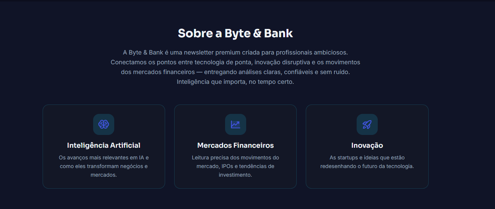
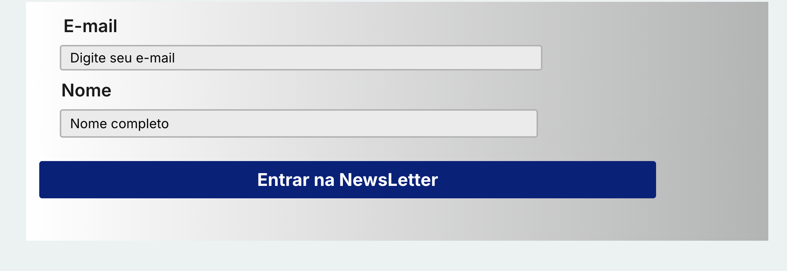

# 📌 Desafio Escolhido

Uma aplicação que automatiza o cadastro de usuários em uma newsletter de tecnologia e finanças.

### A aplicação:

* Permite o cadastro de nome e e-mail;
* Armazena os dados em banco de dados da própria plataforma;
* Envia automaticamente um e-mail de confirmação ao usuário.

#### O projeto desenvolvido recebeu o nome Byte & Bank.

# 🖥️ Protótipo

O protótipo é uma landing page responsiva voltada para conteúdos sobre tecnologia, inteligência artificial e mercado financeiro.

### Funcionalidades implementadas:

* Cadastro de usuários via formulário;
* Armazenamento automático em banco de dados;
* Envio automático de e-mail de confirmação;
* Feedback visual de cadastro realizado com sucesso;

# Funcionamento

O usuário acessa a página inicial e preenche o nome e o e-mail; ao clicar no botão “Entrar na Newsletter”, os dados são enviados para o banco de dados e o sistema envia automaticamente um e-mail de confirmação, após isso uma mensagem de sucesso é exibida na tela.

# Protótipo

# ⚙️ Plataforma Utilizada
Bubble
## Justificativa da escolha

A plataforma Bubble foi escolhida por permitir:

* Criação visual da interface;
* Integração entre frontend e backend;
* Banco de dados integrado;
* Automações sem necessidade de programação tradicional;
* Não haver necessidade de uso de serviços fora do bubble.

# ✅ Vantagens Identificadas
* Desenvolvimento rápido;
* Facilidade de integração entre interface, banco de dados e automações;
* Redução da necessidade de programação tradicional;
* Possibilidade de validação rápida de ideias de produto.

# ⚠️ Limitações Encontradas
* Dependência da infraestrutura da plataforma;
* Curva de aprendizado inicial dos workflows do Bubble;
* Restrições do plano gratuito para deploy e recursos;
* A escalabilidade depende limites da plataforma Bubble e do plano utilizado, o prótipo feito serve mais como uma forma de validação do MVP.

# 📚 Reflexão Crítica

Enquanto faziamos o projeto, percebemos que as plataformas usadas(primeiramente wordpress e, posteriormente o bubble) aceleram significativamente a construção de aplicações, porém também apresentam limitações relacionadas à flexibilidade e controle técnico.

Percebemos que ferramentas low code podem ser muito eficientes para a criação rápida de MVPs e validação de ideias, porém questões relacionadas a escalabilidade e crescimento da aplicação devem ser constantemente analisadas conforme o aumento da demanda do sistema.

# 📝 Próximos passos
* Criação de uma página de admin para gerenciar os usuários cadastrados
* Criação de tópicos, filtros e pesquisas para facilitar encontrar nóticias de interesse dos usuários

# Link do projeto
https://araujoluan3121.bubbleapps.io/version-test?debug_mode=false

## Nome
* Luan Araújo 
* Guilherme Galvão Silva